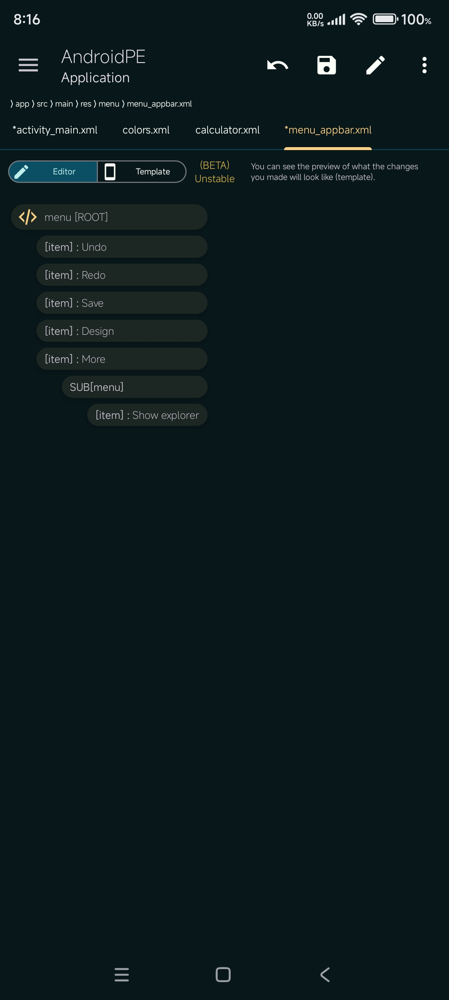

<h2 align="center">Android : Project Editor</h2>
 

  An application to efficiently and quickly manage your resources of your Android projects based on Gradle on your Android phone.

### Features
- [X] Layout Editor
    - [X] WYSIWYG editing
    - [X] Drag and drop
    - [X] Component properties with value auto-completion
    - [X] Preview mode
- [X] strings, colors, dimens & menus can be modified by assistance
- [X] Supports multi-module projects
- [X] Manage activities, permissions, ...
- [ ] Language servers for Code Editor

### Screenshots

 
 
 
 
 
 
 
 
 

### Contact
- Telegram: https://t.me/android_pe

### Thanks to
- Rosette Bikangu for Support
- Shibu Barman
- [Rosemoe](https://github.com/Rosemoe) for [sora-editor](https://github.com/Rosemoe/sora-editor)
- [Akash Yadav](https://github.com/itsaky) for creating [AndroidIDE](https://github.com/AndroidIDEOfficial/AndroidIDE)
